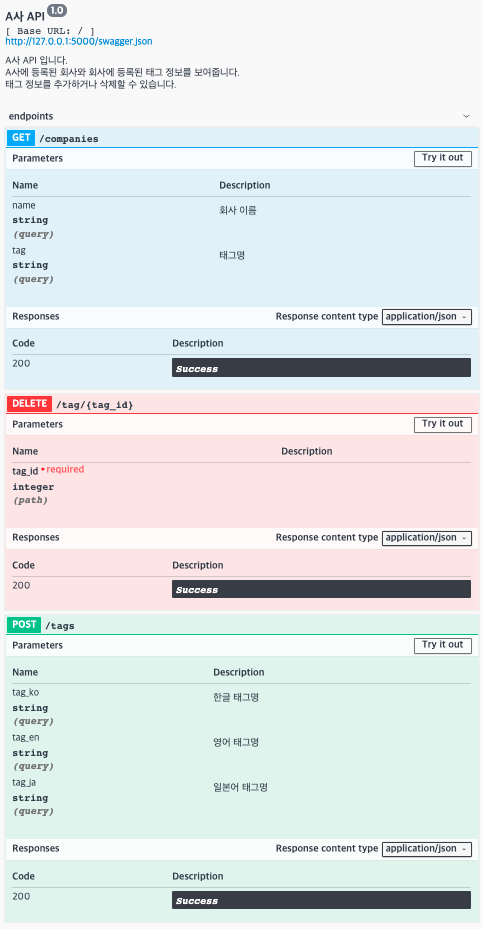

# A사 API 설계 과제

- AWS Lambda, AWS API Gateway를 통해 서버리스 방식으로 구현
- sample 데이터 파일 RDS에 업로드하여 구성

## API 명세

## 사용기술
- Flask
- Postgres
- Docker

## 주요 라이브러리
- [flask-restplus](https://flask-restplus.readthedocs.io/en/stable/index.html)
- [Flask-SQLAlchemy](https://flask-sqlalchemy.palletsprojects.com/en/2.x/)
- [Flask-Migrate](https://flask-migrate.readthedocs.io/en/latest/)
- [Flask-Testing](https://pythonhosted.org/Flask-Testing/)
- [Portainer](https://www.portainer.io/installation//)
- [Zappa](https://github.com/Miserlou/Zappa)    

## DB 설정하기
- Docker를 통해 로컬 Postgres DB 설정
~~~
$ docker pull postgres:10.6
$ mkdir -p ~/docker/volumes/postgres/wanted-rest-api
$ docker run --rm --name wanted-rest-api -e POSTGRES_PASSWORD=wantedrestapi -d -p 5432:5432 -v ~/docker/volumes/postgres/wantedrestapi:/var/lib/postgresql/data postgres:10.6
~~~

- Docker 컨테이너 및 이미지 리스트를 Portainer를 통해 GUI로 확인
    - 아래 커맨드로 실행 후, 9000번 포트로 접속 
~~~
$ docker run -d -p 9000:9000 -v /var/run/docker.sock:/var/run/docker.sock -v portainer_data:/data portainer/portainer
~~~

